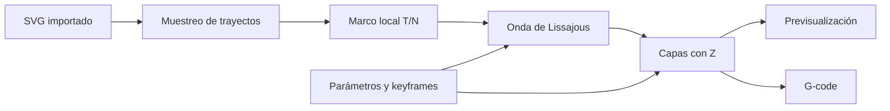
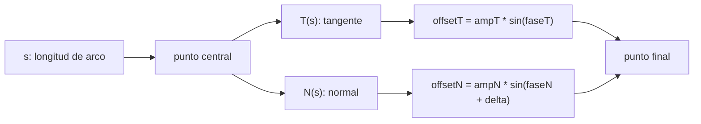
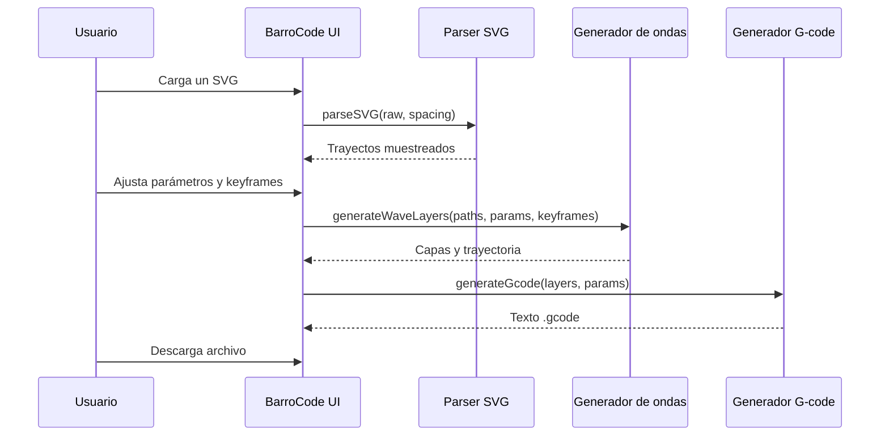
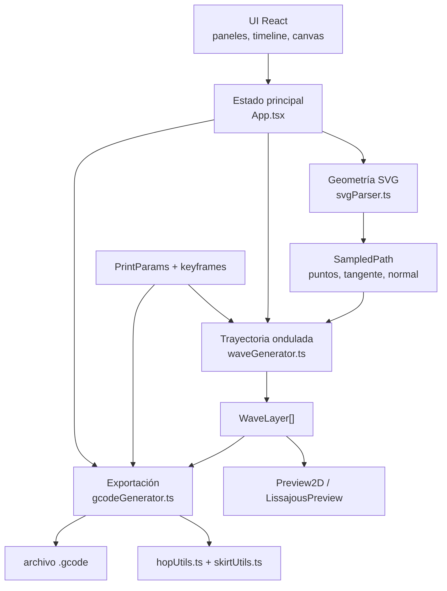
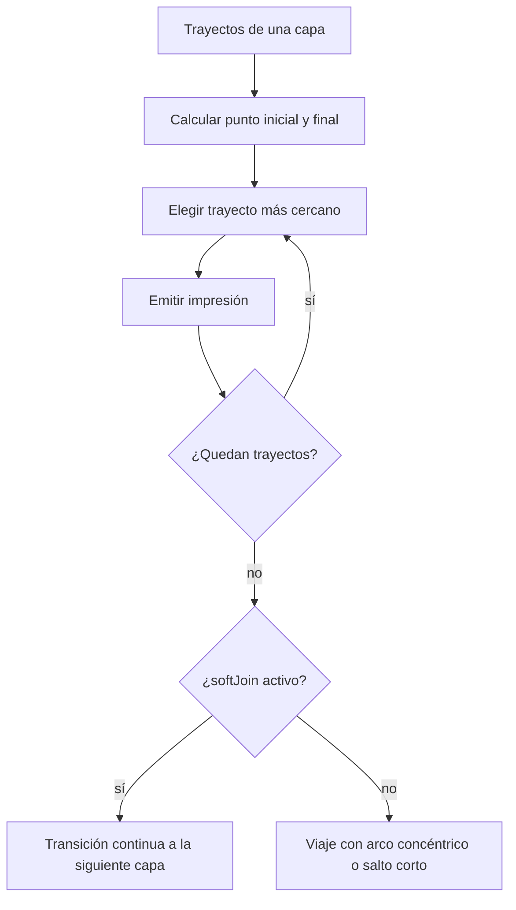

# BarroCode

Herramienta web para convertir curvas `.svg` en trayectorias oscilantes `.gcode` para modelado por deposición líquida. Está pensada para extrusoras de arcilla y máquinas CNC donde importa sostener flujo, continuidad de capa y control geométrico.

BarroCode toma un dibujo vectorial como línea central, lo muestrea sobre su longitud de arco y desplaza cada punto con una figura local de Lissajous. El resultado es una trayectoria imprimible por capas, con unión suave entre alturas, Z-hop sobre cruces, viajes concéntricos y exportación directa a G-code.

## Inicio Rápido

```bash
npm install
npm run dev
```

Abre la URL que aparece en la terminal, normalmente `http://localhost:5173`.

Para generar una versión estática:

```bash
npm run build
```

El build queda en `dist/` y puede servirse desde cualquier servidor estático o publicarse en GitHub Pages.

## Qué Genera

- **Entrada:** un SVG con `<path>`, `<polyline>`, `<polygon>`, `<line>`, `<circle>`, `<ellipse>` o `<rect>`.
- **Proceso:** muestreo por longitud de arco, marco local tangente/normal, onda de Lissajous, apilado por capas y optimización de viajes.
- **Salida:** G-code absoluto en milímetros, con opción de extrusión `E`.
- **Uso previsto:** impresión continua de arcilla, sin retracción, con trayectorias orgánicas controladas desde una curva central.



## Cómo Funciona

El trayecto de impresión es la suma de una línea central y dos oscilaciones locales:

```text
punto_final(s) = línea_central(s)
               + N(s) · ampN · sin(2π·s/λN + δ)
               + T(s) · ampT · sin(2π·s/λT)
```

- `s` es la longitud de arco acumulada sobre el camino SVG.
- `N(s)` es el vector normal unitario del trayecto.
- `T(s)` es el vector tangente unitario del trayecto.
- `λN` y `λT` son longitudes de onda medidas sobre el arco, no sobre un eje recto.
- `δ` controla la diferencia de fase entre normal y tangente, y por lo tanto la figura de Lissajous.



La previsualización **Marco del extrusor** muestra la figura de Lissajous en coordenadas locales `(T, N)`, desacoplada del trayecto global. Sirve para afinar la forma de la oscilación antes de evaluar cómo se adapta al SVG.

## Flujo De Uso



1. Carga un SVG o usa el archivo de ejemplo.
2. Activa, desactiva o ajusta trayectos individuales.
3. Define muestreo, escala, capas, velocidades y comportamiento de arcilla.
4. Ajusta amplitud, longitud de onda y fase de Lissajous.
5. Usa keyframes para interpolar parámetros a lo largo de la trayectoria.
6. Previsualiza capas, transiciones, Z-hop y posición del extrusor.
7. Exporta el `.gcode`.

Los parámetros detallados están en [docs/usage.md](docs/usage.md).

## Arquitectura



- `src/lib/svgParser.ts` inserta el SVG en un contenedor oculto y usa la API SVG del navegador para medir longitudes y puntos.
- `src/lib/waveGenerator.ts` calcula offsets de Lissajous, keyframes, escala alrededor de centro y capas.
- `src/lib/gcodeGenerator.ts` convierte capas a G-code, ordena trayectos por nearest-neighbor, aplica soft join, Z-hop y viajes concéntricos.
- `src/components/Preview2D.tsx` dibuja la previsualización ortográfica en Canvas.

Más detalle técnico en [docs/architecture.md](docs/architecture.md).

## G-code Generado

```gcode
; Encabezado con valores de parámetros
G21        ; unidades en mm
G90        ; posicionamiento absoluto
G92 E0     ; resetear extrusión
G1 Z20     ; Z seguro

; --- Capa 1  Z=1.000 ---
G1 X.. Y.. F1500     ; desplazamiento
G1 Z1.000 F1500      ; descenso
G1 X.. Y.. E.. F600  ; impresión
...
```

La estrategia de desplazamientos ordena trayectos por cercanía y evita saltos largos cuando corresponde:



## Limitaciones Conocidas

- **Transforms anidados complejos en SVG:** los transforms simples sobre elementos individuales funcionan bien; grupos profundamente anidados pueden no resolverse completamente.
- **Unidades SVG no son mm por defecto:** ajusta el factor de escala según el sistema de coordenadas del archivo.
- **Sin retracción:** la salida está orientada a arcilla, donde cortar flujo suele ser indeseable.
- **Modelo de extrusión lineal:** `E += distancia * multiplicador`.
- **Sin malla de nivelación de cama.**

## Estructura Del Proyecto

```text
src/
  types/index.ts
  lib/
    svgParser.ts
    waveGenerator.ts
    gcodeGenerator.ts
    hopUtils.ts
    skirtUtils.ts
  components/
    PathParams.tsx
    LissajousParams.tsx
    PathList.tsx
    Preview2D.tsx
    LissajousPreview.tsx
    GcodeOutput.tsx
    CenterScaleParams.tsx
    NumInput.tsx
public/
  sample.svg
  logo.png
  isotype.png
  fonts/
dist/
```

## Documentación

- [docs/usage.md](docs/usage.md): flujo de uso y parámetros.
- [docs/architecture.md](docs/architecture.md): pipeline interno y responsabilidades.
- [docs/fabrication-notes.md](docs/fabrication-notes.md): criterios de fabricación con arcilla.
- [docs/research-notes.md](docs/research-notes.md): ideas de diseño y fabricación en exploración.
- [pendientes.md](pendientes.md): backlog accionable de tickets atómicos, priorizado.

## Tecnologías

- [Vite 5](https://vitejs.dev/) + [React 18](https://react.dev/) + TypeScript strict.
- Canvas API para previsualización.
- Sin dependencias de UI externas; el sistema visual vive en `src/index.css`.
