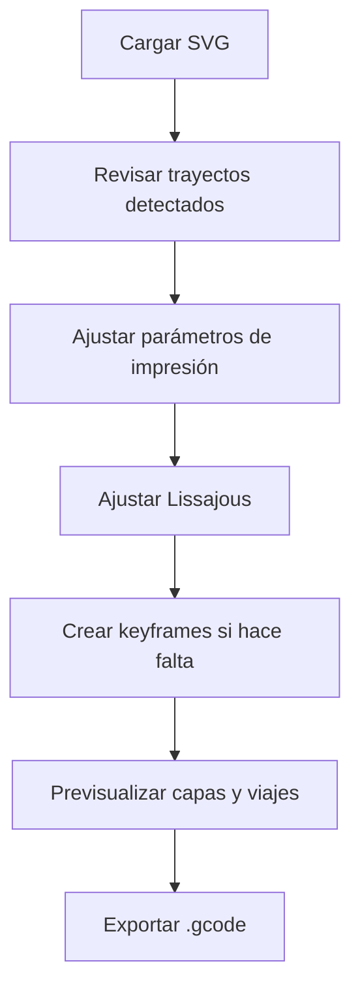

# Uso De BarroCode

Esta guía describe el flujo de uso de BarroCode desde la carga del SVG hasta la exportación del G-code.

## Flujo General

## 1. Cargar Un SVG

Arrastra un archivo SVG al área de carga o haz clic en ella.

Elementos soportados:

- `<path>`
- `<polyline>`
- `<polygon>`
- `<line>`
- `<circle>`
- `<ellipse>`
- `<rect>`

Si no tienes un archivo a mano, usa el navegador de muestras integrado: cuatro SVGs geométricos están embebidos directamente en la aplicación. Las flechas `‹` / `›` cambian de muestra y el clic en la miniatura la carga.

## 2. Revisar Trayectos

Cada elemento geométrico detectado aparece en **Trayectos SVG**.

Puedes:

- activar o desactivar trayectos individuales;
- sobrescribir amplitud normal/tangente por trayecto;
- sobrescribir longitud de onda normal/tangente por trayecto.

Si un override queda vacío, BarroCode usa el valor global.

## 3. Parámetros De Impresión

| Parámetro | Efecto |
|---|---|
| **Espaciado de muestras** | Densidad de muestreo del camino en unidades SVG. Menor valor produce una onda más suave y más puntos. |
| **Altura de capa** | Incremento Z entre capas apiladas. |
| **Número de capas / Altura total** | Define cuántas capas generar, directamente o derivadas desde altura total. |
| **Offset Z de boquilla** | Se suma al Z de cada capa para calibrar la primera capa. |
| **Z seguro** | Altura de desplazamiento cuando no se usa transición suave. |
| **Factor de escala** | Convierte unidades SVG a mm. Usa `1` si el SVG está en mm; usa `0.2645` para píxeles a 96 dpi. |
| **Origen X / Y** | Desplaza toda la impresión sobre la cama. |
| **Invertir Y** | Espeja el eje Y para convertir coordenadas SVG, que crecen hacia abajo, a coordenadas de impresora. |
| **Velocidad de impresión / desplazamiento** | Define avances en mm/min. |
| **Generar valores E** | Incluye la columna de extrusión `E`. Desactívalo para salida solo de movimiento. |
| **Multiplicador de extrusión** | Unidades `E` por mm de desplazamiento. Ajustar según bomba, presión o tornillo sin fin. |
| **Transición Z suave** | Conecta una capa con la siguiente con movimiento continuo, sin retracción ni levantamiento. |
| **Arco de transición** | Longitud en mm durante la transición entre capas. |
| **Dirección alternada** | Invierte capas impares para reducir deriva direccional. |
| **Cerrar trayecto** | Agrega retorno al inicio de cada trayecto. |
| **Pausa al inicio** | Inserta `G4` en la primera posición para estabilizar el flujo de arcilla. |
| **Movimiento de cebado** | Extruye una línea corta antes de la impresión principal. |

## 4. Parámetros De Lissajous

| Parámetro | Efecto |
|---|---|
| **Amplitud N** | Semi-amplitud lateral, sobre la normal del trayecto. |
| **Amplitud T** | Semi-amplitud adelante/atrás, sobre la tangente. |
| **Longitud de onda N / T** | Longitud de arco de un ciclo completo de onda. |
| **Delta** | Diferencia de fase entre N y T. `0°` tiende a línea; `90°` tiende a elipse cuando las longitudes de onda coinciden. |
| **Offset de fase** | Fase inicial de la onda. |
| **Desfase por capa** | Fase extra aplicada por capa para crear torsión o comportamiento helicoidal. |

Los preajustes aplican combinaciones de amplitud, longitud de onda y fase con una miniatura de la figura local resultante.

## 5. Keyframes

La línea de tiempo permite anclar parámetros de Lissajous en posiciones específicas de la trayectoria.

1. Mueve el slider al punto deseado.
2. Ajusta los parámetros.
3. Haz clic en **⊕ KF**.
4. Edita el keyframe seleccionado si necesitas ajustar amplitudes, longitudes de onda, delta, centro o escala.

Entre keyframes, BarroCode interpola linealmente.

## 6. Previsualización

La vista global muestra:

- líneas coloreadas por capa;
- transiciones entre capas;
- Z-hop sobre cruces;
- viajes concéntricos cuando no hay soft join;
- posición virtual del extrusor;
- cubo de orientación X/Y/Z.

| Control | Acción |
|---|---|
| Arrastrar con botón izquierdo | Pan |
| Arrastrar con botón derecho | Rotar azimut/elevación |
| Rueda del mouse | Zoom |
| **Ajustar** | Encuadre automático |

## 7. Exportar

Haz clic en **Descargar .gcode**. El nombre del archivo se deriva del SVG cargado, por ejemplo `mi-vasija.gcode`.
